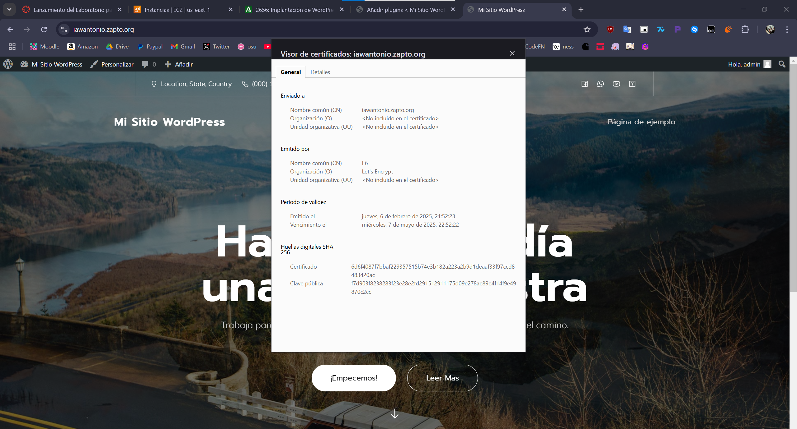

# Instalación de WordPress en una Arquitectura de Tres Niveles con Ansible

## Estructura del Repositorio

```bash
.
├── README.md
├── templates
│   └── 000-default.conf
    └── load_balancer.conf
├── inventory
│   └── inventory
├── playbooks
│   ├── setup_load_balancer.yml
│   ├── install_lamp_frontend.yml
│   ├── install_lamp_backend.yml
│   ├── setup_nfs_server.yml
│   ├── setup_nfs_client.yml
│   ├── setup_letsencrypt.yml
│   ├── deploy_wordpress_backend.yml
│   └── deploy_wordpress_frontend.yml
├── vars
│   └── variables.yml
└── main.yml
```

## Requisitos Previos
- Cuenta en AWS con acceso a EC2.
- Configuración de una clave SSH para acceder a las instancias.
- Instalación de Ansible en la máquina de control.
- Scripts de Bash de la práctica 1.11 como referencia.
- Dominio en NO-IP apuntando a la IP del balanceador

## Componentes de la Arquitectura
1. **Balanceador de carga**
2. **2 Servidores Frontend**
3. **Servidor Backend**
4. **Servidor NFS**

---

## Archivo de Inventario (`inventory`)
```ini
[frontend]
44.198.114.226
3.209.122.36

[frontend1]
44.198.114.226

[backend]
3.228.191.19

[balanceador]
44.214.122.40

[nfs]
52.72.51.117
```

---

## Proceso de Ejecución
1. Configurar los servidores LAMP (`install_lamp_frontend.yml` y `install_lamp_backend.yml`).
2. Configurar la base de datos.
3. Configurar el servidor y los clientes NFS (los dos frontends).
4. Configurar el balanceador de carga y el certificado SSL.
5. Desplegar WordPress en uno de los frontends.

---

## Instalación de WordPress

Para la instalación de WordPress, seguimos los siguientes pasos:
- Descarga de WP-CLI.
- Descarga del código fuente de WordPress.
- Configuración del archivo `wp-config.php`.
- Instalación y configuración de WordPress.
- Asignación de permisos adecuados.
- Instalación y activación del tema **Mindscape**.
- Instalación y activación de plugins.
- Configuración de enlaces permanentes.
- Configuración del archivo `.htaccess`.
- Modificación de la variable `$_SERVER['HTTPS']` en `wp-config.php`.

Para modificar `wp-config.php`, utilizamos el módulo `lineinfile` de Ansible:

```yaml
- name: Asegurar que $_SERVER['HTTPS'] esté en wp-config.php
  lineinfile:
    path: /var/www/html/wp-config.php
    line: "$_SERVER['HTTPS'] = 'on';"
    state: present
    insertbefore: "^define\\( 'DB_NAME', 'wordpress' \\);"
```

> **Explicación:**
> - `insertbefore`: Inserta la línea antes de la configuración de la base de datos.
> - `^` indica el inicio de la línea.
> - `\\` se usa para escapar los paréntesis `()` y literalmente como texto.

### Instalación del Tema `Mindscape`
En mi caso la instalación del tema requería privilegios de root.

```yaml
- name: Instalar y activar el tema Mindscape
  command: wp theme install mindscape --activate --path=/var/www/html --allow-root
  become: yes
```

Para activar el tema manualmente:
```bash
wp theme activate mindscape --path=/var/www/html --allow-root
```

Para activar un plugin:
```bash
wp plugin activate plugin-name --path=/var/www/html --allow-root
```

---

## Comprobaciones

### Salida de los playbooks de Ansible

### Instalación de Plugins


### Verificación de Página de Ejemplo


### Acceso con `wps-hide-login`


### Verificación del Certificado SSL


### Configuración de No-IP


### Prueba de que el NO-IP apunta a mi balanceador


---
